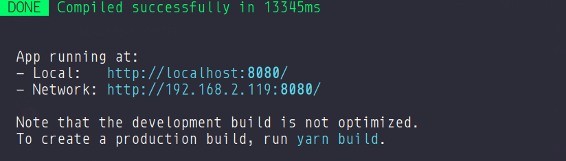

# LuizaLabs - Frontend

> **Desafio Luizalabs** Frontend.<br />

<p align="center"></p>

## ⚓ Links

👉 [http://luizalabs.online](http://luizalabs.online)

## Pré-requisitos

-   NodeJs v16.9.1
-   Yarn v1.22.19
-   Docker version 20.10.22, build 3a2c30b
-   docker-compose version 1.29.2, build 5becea4c

## Como instalar o projeto

```bash
# Clona o repositório
git clone https://github.com/eneas-almeida/luizalabs-frontend

# Acessa a pasta do repositório clonado
cd luizalabs-frontend

# Instala os pacotes com o yarn
yarn install
```

## Como rodar o projeto

```bash
# Executa o script dev do package.json
yarn serve
```

Ao executar o comando acima, deverá apresentar essa tela:



© Documento elaborado por <a href="https://github.com/eneas-almeida">Enéas Almeida</a>.
